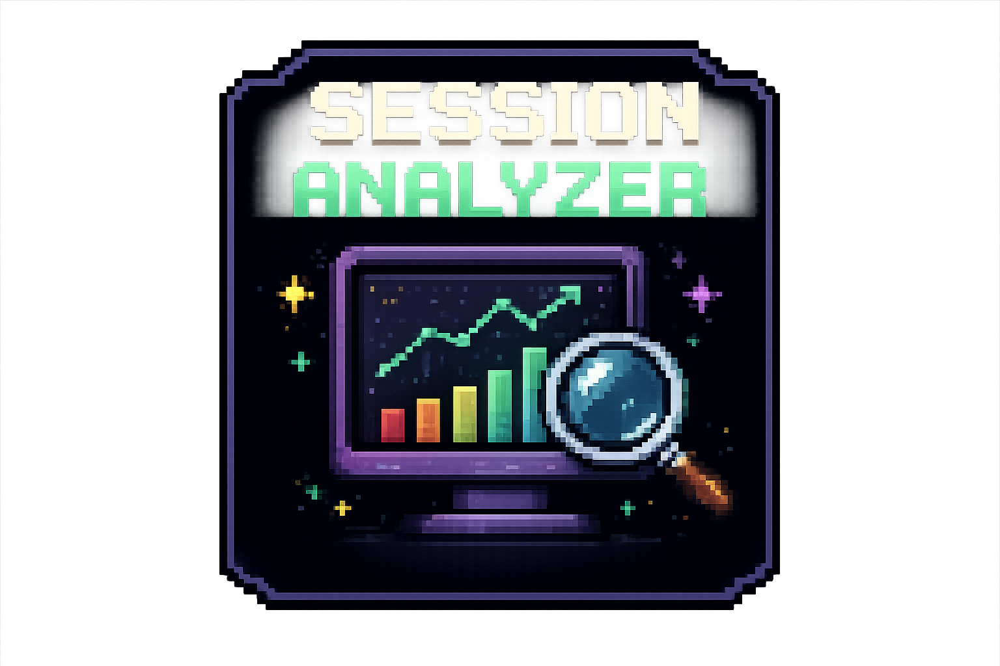
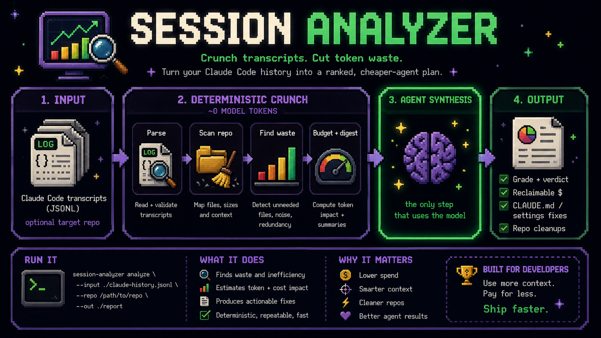

<div align="center">



# Session Analyzer

It reads your Claude Code history and tells you how to fix your sessions so they cost less.

**~41–47% fewer tokens, with no loss in output quality** — measured across Sonnet 4.6 and Opus 4.8 ([proven below](#proven-savings)).

Zero dependencies · deterministic · hard token budget

</div>

---

> Driving this with an agent? See [AGENTS.md](AGENTS.md).

## What it does

Claude Code writes every session to disk as a JSONL transcript with per-turn
token usage. session-analyzer reads those transcripts, and optionally your repo,
and returns a ranked list of what to fix.

The crunching is plain Python and costs no model tokens. It turns megabytes of
transcripts into a few KB of digest. An agent reads only that digest and writes
the judgment calls: the actual `CLAUDE.md` edits, the `settings.json` allowlist,
the prompt changes, and the agent-read material stays tiny — a few KB, well under
a hard ceiling (200K one mode, 400K both).

## Proven savings

Measured, not estimated. The [`bench/`](bench/) harness runs the same tasks twice
under `claude -p` — once with no orientation file, once with the kind of
`CLAUDE.md` this tool recommends generating — recording real token usage and a
deterministic success check (tests pass, or the answer names the right file).

8 tasks (navigation, multi-file edits, comprehension), ≥2 repeats each, run on
two models — and the savings hold on both, with task success unchanged at 100%
in every arm:

| model | simple suite | harder suite | combined |
| --- | --- | --- | --- |
| Sonnet 4.6 | 50.9% | 26.8% | **40.9%** |
| Opus 4.8 | 41.7% | 53.1% | **47.2%** |

**~41–47% fewer tokens with task success unchanged.** The win is largest where a
tight map replaces exploration and smaller on tasks with irreducible edit/test
work. Reproduce:

```bash
python3 bench/run.py && python3 bench/report.py
```

Full method and limits: [`bench/README.md`](bench/README.md).

## Better loops

Token savings is half the story. The other half: encoding the verification step
Claude *can't infer* makes it catch its own mistakes instead of handing back a
plausible-but-wrong answer — fewer back-and-forths, more autonomy.

On a suite of edge-case tasks where the obvious implementation is wrong (a
discount that forgets to clamp, an average that divides by zero on empty), the
same A/B — and the gate brings both models to 100% first-pass correct:

| model | no verify gate | verify gate encoded |
| --- | --- | --- |
| Sonnet 4.6 | 50% | 100% |
| Opus 4.8 | 67% | 100% |

It costs a few more turns — the agent runs the check and fixes — and that is the
point: right the first time. See [`bench/tasks-loop.jsonl`](bench/tasks-loop.jsonl).

## How it works



```
transcripts  ->  deterministic crunch  ->  digest.md  ->  agent synthesis  ->  report
 (+ repo)         Python, ~0 tokens         a few KB       your judgment
```

1. Extract: scripts parse transcripts and scan the repo. No model tokens.
2. Read the digest: a few KB, never the raw transcripts.
3. Synthesize: the agent turns findings into copy-pasteable fixes.
4. Report: terminal or Markdown, ranked by impact.

## Modes

**`tokens`** finds where sessions waste tokens:

- Cache misses. A low cache-hit ratio means paying full input rate for context
  that could be cached. Usually the biggest lever.
- The same file read 3+ times in one session.
- Oversized tool outputs flooding the context window.
- Retry loops: identical commands re-run.
- Permission and error friction forcing round-trips.
- Context thrash: frequent compaction from a bloated standing prompt.

**`repo`** scans a target repo for what slows agents down:

- Junk artifacts: committed logs, `.DS_Store`, `.orig`/`.bak`/`.tmp`.
- Exact and near-duplicate files (near-dup catches reformatted copy-paste).
- Orphan library modules nothing imports, path-resolved and kept separate from
  intentional standalone scripts.
- Oversized files.
- Commented-out code blocks (JSDoc excluded).
- Ambiguous basenames: the same filename across many directories.

Generated, minified, and vendored files are counted for size but excluded from
refactor findings, so it does not flag what is not yours to change. See
[OPTIMIZATION_LOG.md](OPTIMIZATION_LOG.md).

**`both`** runs the two under a 400K cap and ranks across them.

## Install

No dependencies. Python 3.9+.

```bash
git clone https://github.com/Jacknelson6/session-analyzer.git
cd session-analyzer
./bin/analyze --help
```

To use it as a Claude Code skill, put the folder at
`~/.claude/skills/session-analyzer/`. It never writes to the repo it analyzes
except under `.sa/`.

## Usage

### Talking to it

As a skill you do not type commands. Say "session analyzer" (or
`/session-analyzer`), then what you want. The agent picks the mode, points it at
your project, and runs it.

| Say this | What you get |
| --- | --- |
| "session analyzer, tokens" | Token waste across all sessions |
| "session analyzer, tokens, just this repo" | Token waste, scoped to the current project |
| "session analyzer, clean up this repo" | Repo hygiene scan |
| "session analyzer, both" | Tokens and repo, ranked together |
| "session analyzer, both, last 7 days, as markdown" | Both, recent sessions, PR-ready output |
| "why is Claude burning so many tokens?" | Token waste (no trigger phrase needed) |
| "what sessions can it see?" | Discovery check |

You do not manage paths or flags. That is the agent's job.

### By hand (CLI)

```bash
# all sessions
bin/analyze analyze --mode tokens

# scoped to the current repo
bin/analyze analyze --mode tokens --scope-repo --repo "$PWD"

# repo hygiene
bin/analyze analyze --mode repo --repo "$PWD"

# both, write artifacts, render Markdown
bin/analyze analyze --mode both --repo "$PWD" --scope-repo --out .sa/run --format markdown

# re-render a saved run
bin/analyze render .sa/run/bundle.json --format markdown

# what can it see?
bin/analyze doctor

# CI gate: fail under grade B
bin/analyze analyze --mode repo --repo "$PWD" --fail-under B

# last 7 days only
bin/analyze analyze --mode tokens --since 7
```

Flags: `--top N`, `--max-sessions N`, `--since DAYS`, `--projects-root PATH`,
`--format terminal|markdown|json`, `--color auto|always|never`,
`--fail-under A..F`, `--budget TOKENS`, and the four `--price-*` overrides.

## Budget

Extraction is free (~0 model tokens). The agent then reads only a small digest
plus the worst-session shards — a few KB in practice. A full run over 300+ real
sessions read about **9K tokens** of agent-facing material. A hard ceiling (200K
one mode, 400K both) caps it as a backstop; real runs use a fraction of that. See
`budget.json` for the live ledger.

## Architecture

```
bin/analyze            CLI shim
src/
  sessions.py          transcript discovery + parsing
  extract.py           token-waste metrics + findings
  repo_scan.py         repo hygiene scan
  config.py            ignore/classify rules
  pricing.py           token -> USD
  budget.py            the token ledger
  findings.py          the Finding contract
  digest.py            budget-bounded agent artifacts
  report.py            report -> render bundle
  render.py            terminal + markdown output
  theme.py             palette, glyphs, bars (NO_COLOR aware)
tests/                 unittest suite + fixtures
docs/                  transcript + finding schemas
```

## Limits

- Token counts are exact (from `usage`). Reclaimable-cost figures are estimates
  that depend on your prices and on caching being achievable.
- Orphan detection is a heuristic, not a full bundler graph. It is tuned to
  avoid false positives, so it misses some real dead code. It traces JS/TS-style
  imports, so it over-flags files in Python and other languages. Confirm with
  `knip`/`ts-prune`.
- It reads transcripts and source read-only. It never changes your repo or its
  history.

## License

MIT. See [LICENSE](LICENSE).
